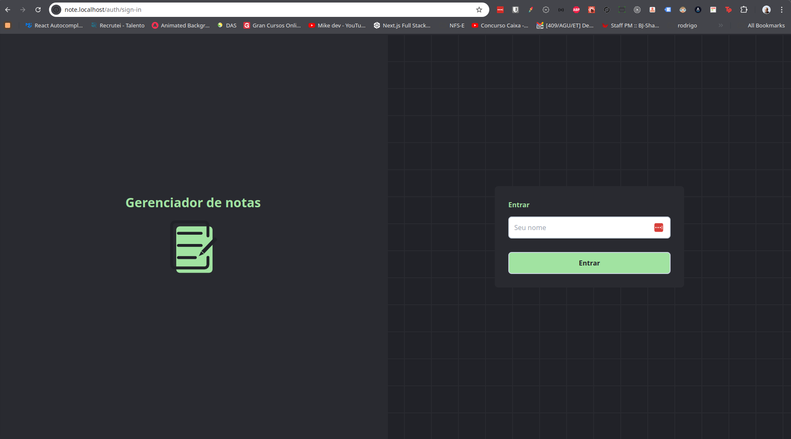
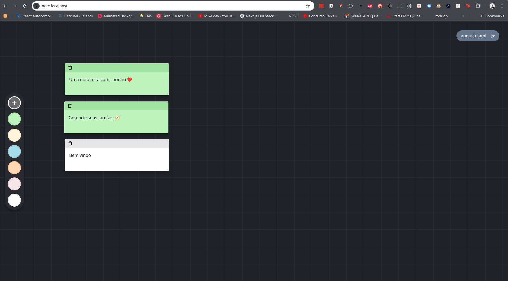

# Note App

Este é um aplicativo CRUD de Notas construído com React, TypeScript e Tailwind CSS, utilizando LocalStorage como banco de dados. A aplicação permite adicionar, editar, alterar a cor e excluir notas.

## Funcionalidades

- **Tela de Login**: Apenas o nome do usuário é necessário para fazer login.
- **CRUD de Notas**:
  - Adicionar novas notas.
  - Alterar a cor das notas.
  - Editar o conteúdo das notas.
  - Excluir notas.

## Imagens

### Sign In


### Note


## Tecnologias Utilizadas

- **Frontend**:
  - [React](https://reactjs.org/)
  - [TypeScript](https://www.typescriptlang.org/)
  - [Tailwind CSS](https://tailwindcss.com/)
  - [Vite](https://vitejs.dev/)
  - [MUI](https://mui.com/) para componentes de interface
- **Linting e Formatação**:
  - [ESLint](https://eslint.org/)
  - [Prettier](https://prettier.io/)
- **Controle de Dependências**:
  - [npm](https://www.npmjs.com/)
- **Ambiente de Desenvolvimento**:
  - [Docker](https://www.docker.com/)
  - [Docker Compose](https://docs.docker.com/compose/)

## Configuração e Execução

### Pré-requisitos

- [Docker](https://www.docker.com/)
- [Docker Compose](https://docs.docker.com/compose/)
- Adicionar `note.localhost` no `/etc/hosts` para configuração do nginx:

```perl
127.0.0.1 note.localhost
```

## Passos para Configuração

1 - Clone este repositório:

```sh
git clone https://github.com/seu-usuario/note-app.git
cd note-app
```

2 - Clone este repositório:

```sh
docker-compose up --build
```

## Estrutura do Projeto

```arduino
├── public
├── src
│   ├── components
│   ├── hooks
│   ├── pages
│   ├── styles
│   ├── types
│   ├── utils
│   └── App.tsx
├── .dockerignore
├── .eslintrc.js
├── .gitignore
├── docker-compose.yml
├── Dockerfile
├── package.json
├── postcss.config.js
├── tailwind.config.js
├── tsconfig.json
└── vite.config.ts
```

### Licença

Este projeto está licenciado sob a Licença MIT - veja o arquivo LICENSE para mais detalhes.


Feito com ❤️ por [José Augusto Monteiro Lima | augustojaml](https://github.com/augustojaml)